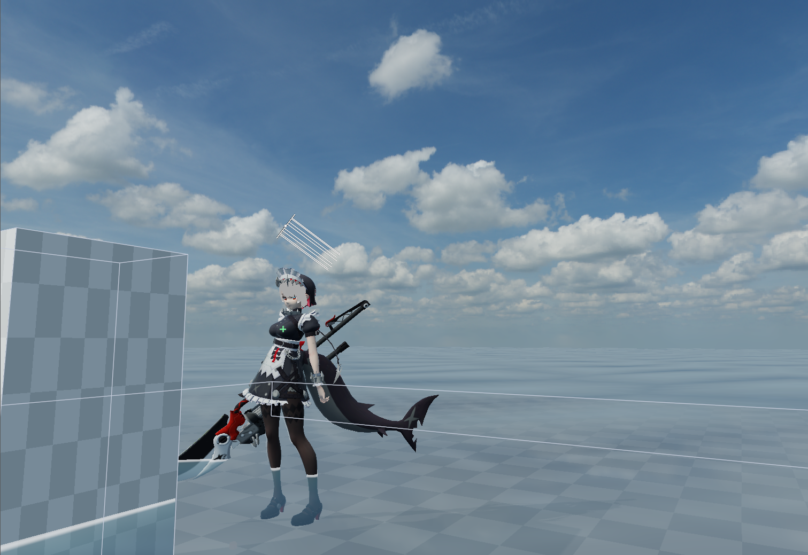
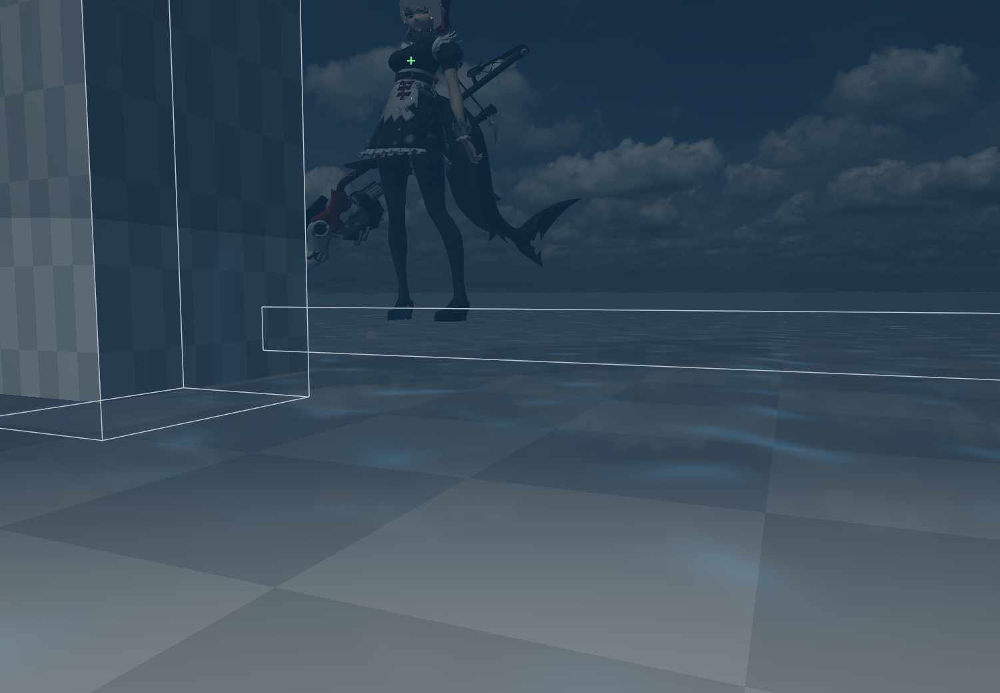
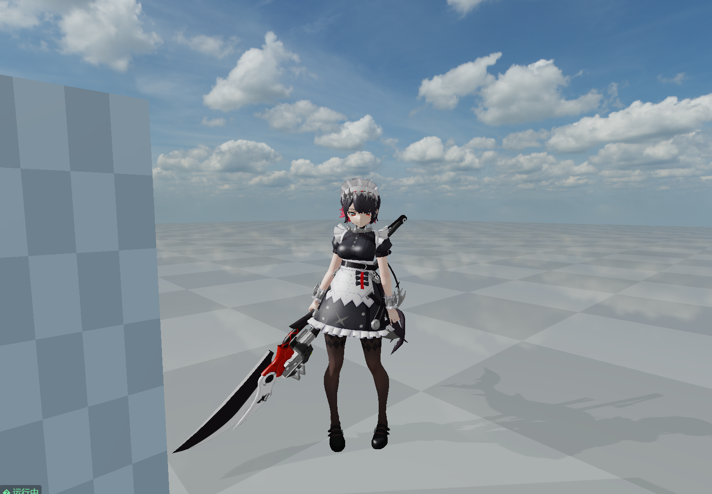
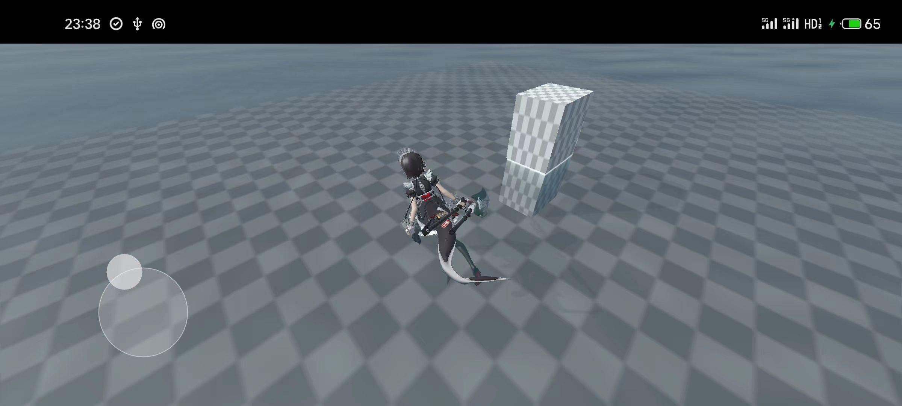
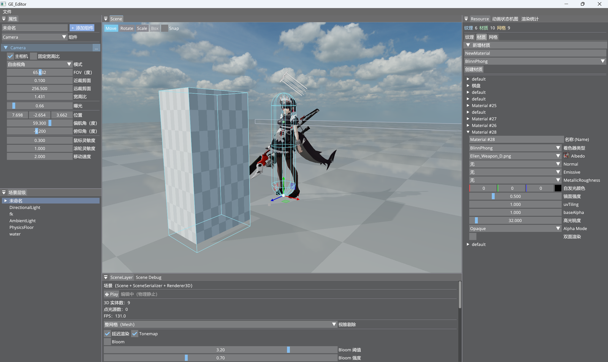
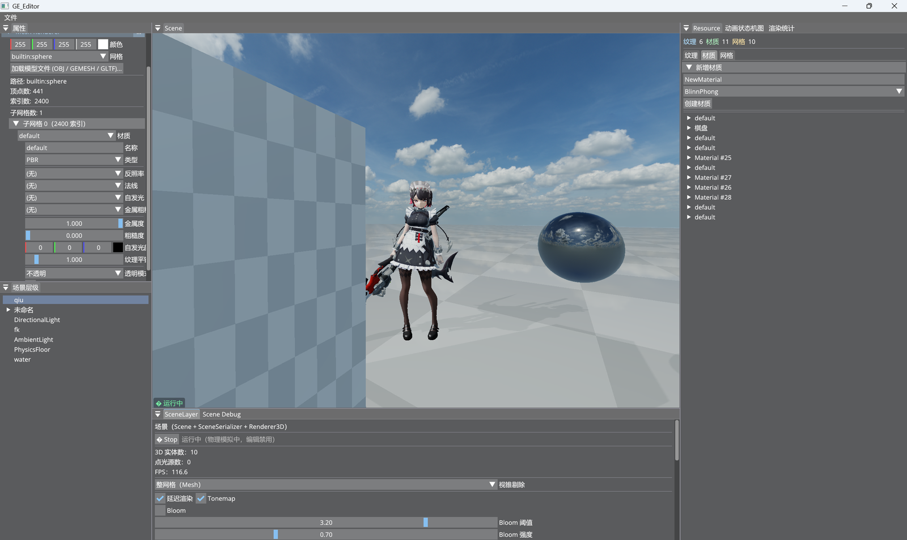
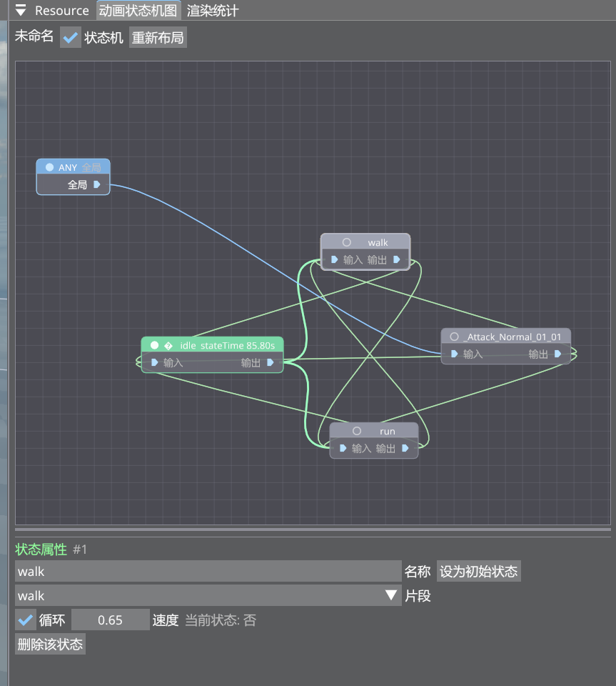
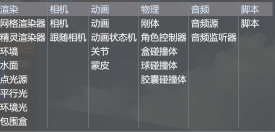

# GE — 自研游戏引擎与编辑器

基于 **Vulkan** 的 C++20 游戏引擎，附带一个功能完整的场景编辑器（`GE_Editor`）。

引擎自底层封装 Vulkan（Instance / Device / Swapchain / Pipeline / DescriptorSet / VMA 内存管理…），上层提供 ECS 场景、前向与延迟两套渲染路径、PBR + IBL、级联阴影、HDR 后处理链、水面与水下效果、骨骼蒙皮与动画状态机、Jolt 物理、Lua 脚本与音频系统。

> 平台：**Windows x64（MSVC）与 Android（arm64-v8a / x86_64）**。两端共用同一套窗口与输入层
> （SDL3，`GE/src/Platform/`，不按平台分目录）；编辑器仅桌面，运行时 `GE_Runtime` 两端都跑。

---

## 截图

**运行时画面**（延迟渲染 + PBR / IBL + CSM 阴影 + 水体与水下后处理 + Bloom）







**Android**（`GE_Runtime` 在设备上：Vulkan 1.3 + 触屏控制）



**编辑器**







*动画状态机（ASM）节点图*



*组件面板*

---

## 功能特性

### 渲染
- **Vulkan 1.3**：`vulkan.hpp` 绑定 + VMA 显存管理 + **动态渲染**（KHR_dynamic_rendering，无 RenderPass 对象）
- **渲染图（RenderGraph）**：pass 声明式编排，虚拟资源池 + 自动屏障/布局转换/生命周期管理
- **两套渲染路径**
  - 前向：Blinn-Phong（方向光 + 任意数量点光源 + 环境光）
  - 延迟：GBuffer（MRT 四张）→ Lighting（全屏，在线性 HDR 空间着色）→ Transparent → Tonemap
- **PBR**：Cook-Torrance 金属-粗糙度工作流，铝箔/自发光/法线/金属粗糙度贴图槽
- **IBL**：split-sum 预滤波环境光（prefilter + skybox + BRDF LUT），天空盒可与 IBL 联动
- **级联阴影（CSM）**：默认 3 级、practical split 切分、逐级 AABB 剔除、PCF 软阴影，各级分辨率/偏差独立可配
- **HDR 后处理链**：`RGBA16F` 中间缓冲 → Bloom（阈值提取 + 多级降/升采样 + 合成）→ ACES Tonemap（曝光可调）
- **水面渲染**：Gerstner 波位移、法线贴图细节、深度感知折射、岸线泡沫、水下焦散与水下后处理（雾/去饱和/暗角）
- **合批与剔除**：相同 mesh + 材质的实例合并为一次 `vkCmdDrawIndexedInstanced`（实例数据走 SSBO）；视锥剔除、阴影包围盒剔除、实体级 AABB 子树裁剪
- **透明渲染**：按 `pass → pipeline → material → mesh → depth` 排序键分区，不透明近→远吃 early-z，透明远→近正确混合
- **异步上传**：纹理/网格数据经 `AsyncUploadManager` 后台线程上传

### 场景与资源
- **ECS**：EnTT，`Scene` + 轻量 `Entity` 包装 + 20 余种组件
- **层级**：父子实体（`TransformComponent::parent`），世界矩阵每帧 DFS 更新；UUID 稳定引用，序列化重排不错乱
- **序列化**：`.scene`（YAML），编辑器保存/加载
- **模型加载**：`glTF/GLB`（tinygltf，含多 primitive / 蒙皮 / 动画）、`OBJ`（tinyobjloader）、引擎内置 `.gemesh` 二进制格式
- **纹理**：stb_image + KTX2（libktx），按路径去重缓存
- **骨骼动画**：蒙皮管线（顶点骨骼加权变形）、动画剪辑加载与混合、**动画状态机 ASM**（配套节点图编辑器）

### 其他子系统
- **物理**：Jolt Physics，固定 60Hz 步长；刚体 / 盒 / 球 / 胶囊碰撞体 / 角色控制器（CharacterVirtual）
- **脚本**：Lua 5.4 + sol2，脚本挂载在实体上，含 `PUBLIC_FIELDS` 面板可编辑公开字段
- **音频**：miniaudio（AudioContext / AudioWorld / 3D 音源）
- **编辑器 UI**：Dear ImGui（Docking + multi-viewport）+ ImGuizmo 变换 gizmo + imgui-node-editor
- **性能分析**：Tracy（可选，`build.bat` 默认开启）+ 引擎内 `GE_PROFILE_*` 宏
- **跨平台**：桌面与 Android 共用 SDL3 窗口 / 输入 / 事件层；Android 上资产只从 APK 内读（`AAssetManager` 后端，见「资产与平台差异」），触屏操作为浮动摇杆 + 拖拽视角 + 轻点（合成引擎既有键/鼠标事件，Lua 脚本零改动）

---

## 目录结构

```
GameEngine/
├── GE/                       # 引擎核心（静态库）
│   ├── include/GE/           # 公开头文件
│   ├── src/                  # 实现
│   │   ├── Core/             # Application / Window / LayerStack / Log / Input
│   │   ├── Events/           # 事件系统
│   │   ├── Render/           # Renderer2D / Renderer3D / 资源管理
│   │   │   ├── VulkanBase/   # Vulkan 底层封装
│   │   │   ├── RenderGraph/  # 渲染图
│   │   │   └── ImGui/        # ImGui 后端
│   │   ├── Scene/            # Scene / Entity / 序列化 / glTF 导入 / ScriptEngine
│   │   ├── Physics/          # Jolt 封装
│   │   ├── Animation/        # 动画剪辑、蒙皮、状态机
│   │   ├── Audio/            # miniaudio 封装
│   │   ├── FileSystem/       # VFS（磁盘 / AAssetManager 两个后端）
│   │   └── Platform/         # 窗口与输入（SDL3，两端共用）+ 平台差异（Windows 文件对话框等）
│   └── third_party/          # 全部第三方依赖（多数已 vendored）
├── GE_Editor/                # 编辑器可执行（仅桌面）
│   └── src/
│       ├── EditorApp.cpp     # 入口，组装各 Layer
│       ├── SceneLayer.cpp    # 场景渲染 + 渲染图 pass 声明
│       ├── Panels/           # 层级 / 资源 / 渲染统计 / ASM 图面板
│       └── NodeEditorUtils/  # 节点图绘制工具
├── GE_Runtime/               # 运行时播放器（桌面 exe + Android libmain.so）
│   └── src/
│       ├── RuntimeApp.cpp    # 入口，只组一个 GameLayer
│       ├── GameLayer.cpp     # 加载入口场景并驱动仿真 + 渲染
│       ├── GameConfig.cpp    # game.cfg（YAML）读取 + 命令行覆盖
│       └── TouchControls.cpp # 触屏操作：浮动摇杆 / 拖拽视角 / 轻点
├── platform/android/         # Android 应用模块（Gradle + SDL 的 Java 胶水 + GEActivity）
├── assets/                   # 共享资源（着色器 / 场景 / 脚本 / 字体 / 纹理）
│   └── shaders/glsl/         # GLSL 着色器，构建时由 glslc 编译为 .spv
├── tools/                    # 辅助工具（见下文）
├── docs/                     # 设计文档与实现计划书
├── CMakeLists.txt            # 主构建脚本（`if(ANDROID)` 分区：桌面独占目标在此跳过）
├── build.bat                 # 桌面 MSVC + Ninja 一键构建
└── build_android.bat         # Android APK 一键构建（收资产 → 编 APK → 解包校验）
```

**桌面运行时以仓库根目录为工作目录** —— 引擎按 `assets/...` 相对路径加载字体、着色器与场景。

**Android 没有"仓库根"这个概念**：资产在 APK 内，只能经 `AAssetManager` 读（见「资产与平台差异」），可写目录（`GE.log` / `imgui.ini`）落到应用私有目录。

---

## 环境要求

| 依赖 | 说明 |
|------|------|
| Windows 10/11 x64 | 桌面平台（编辑器只能在它上面跑） |
| Visual Studio 2022 | 需 MSVC 工具集 + Windows SDK（`build.bat` 通过 `vcvarsall.bat` 初始化） |
| Vulkan SDK | 1.3+，需在 `PATH`/`VULKAN_SDK` 中能找到 **`glslc`**（着色器编译） |
| CMake | 3.15+ |
| Ninja | 随 VS / CMake / CLion 分发 |
| Python 3 | 可选，仅生成环境 IBL 资产与合并贴图时需要 |
| Android SDK + NDK + JDK 17 | **仅构建 Android 时需要**。当前按 NDK `27.3.13750724` / build-tools `36.0.0` / JDK 17 验证；SDK 与 NDK 由 Gradle 驱动，无需手写 toolchain 参数 |

> 除 Vulkan SDK 与 Android 工具链外，所有第三方库均已随仓库携带（`GE/third_party/`），无需额外安装 —— 包括 **SDL3**。

> ⚠️ **资源未入库**：`.gitignore` 排除了大体积资源目录（`assets/models/`、`assets/materal/`、`assets/environments/`、`assets/audio/`、`assets/HDRI/`、`*.ktx`/`*.ktx2`）。克隆后需自行准备这些资源，场景中的模型/环境引用才能正常加载；纯引擎与编辑器本身可正常构建运行。构建 Android 包时，还要先用 `gepack` 把入口场景依赖的资产收成 `dist/`（见下文）。

---

## 构建

### 一键脚本（推荐）

```bat
build.bat                  :: Debug 构建（默认）
build.bat release          :: Release 构建
build.bat release rebuild  :: 清理后 Release 构建
build.bat -h               :: 查看帮助
```

脚本会自动初始化 MSVC 环境、调用 CMake 配置（Ninja 生成器）并编译，产物输出到 `bin/`。

> 首次使用请修改 `build.bat` 顶部的 `MSVC_TOOLS` 变量，指向本机 MSVC 安装路径（默认 `F:\c++budiltool`，即 `vcvarsall.bat` 与 Ninja 所在位置）。

### 手动 CMake

```bat
cmake -B bin-int-msvc -G Ninja ^
      -DCMAKE_BUILD_TYPE=Debug ^
      -DCMAKE_C_COMPILER=cl.exe -DCMAKE_CXX_COMPILER=cl.exe
cmake --build bin-int-msvc
```

需在已初始化 MSVC 环境的终端中执行。

### Android（APK）

```bat
build_android.bat                  :: 收资产 → 删旧 APK → assembleDebug → 解包校验
build_android.bat nopack           :: 资产没动时跳过 gepack
build_android.bat nopack install   :: 编完直接装到设备/模拟器并启动
build_android.bat -h               :: 查看帮助
```

产物：`platform/android/app/build/outputs/apk/debug/app-debug.apk`（arm64-v8a + x86_64 两个 ABI）。

前提是**先跑过一次桌面构建**，因为资产要由主机侧工具收：`bin/gepack.exe` 按入口场景的依赖图把资产收进 `dist/`，
再由 Gradle 接成 APK 的 `assets/`。改过场景或资产后重跑 `build_android.bat` 即可（它会先收一次资产，实测数秒）。

该脚本第 4 步是**解包校验**，不是形式：本项目有几次"构建照样成功、产物却是错的"前科（`libmain.so` 命名、
资产多套一层 `assets/`、下划线开头的资产目录被 AGP 静默丢弃），都只有解包才看得出。详见
[`docs/Android运行与打包流程.md`](docs/Android运行与打包流程.md)。

装到设备：

```bat
adb install -r -t platform\android\app\build\outputs\apk\debug\app-debug.apk
adb shell am start -n com.ge.runtime/.GEActivity
adb logcat -s GE
```

### 构建目标

| 目标 | 产物 | 说明 |
|------|------|------|
| `GE` | `GE.lib` | 引擎核心静态库 |
| `GE_Editor` | `GE_Editor.exe` | 编辑器（仅桌面） |
| `GE_Runtime` | `GE_Runtime.exe` / `libmain.so` | 运行时播放器。桌面是可执行文件；Android 上必须是名为 **`libmain.so` 的共享库**（SDL 的 Java 启动器按这个名字去 `dlsym("SDL_main")`） |
| `gemesh` | `gemesh.exe` | `.gemesh` 离线导出 CLI（仅桌面） |
| `gepack` | `gepack.exe` | 依赖收集 + 打包 CLI，产出 `dist/`（仅桌面） |
| `GEShaderCompile` / `ShaderCompile` | `*.spv` | GLSL → SPIR-V（构建时自动触发） |

---

## 运行

### 编辑器（桌面）

在**仓库根目录**下运行，否则相对路径资源加载会失败：

```bat
bin\GE_Editor.exe
```

编辑器启动后：顶部「文件」菜单新建 / 打开 / 保存场景（`assets/scenes/*.scene`），右侧层级面板增删实体与组件，资源面板浏览纹理/材质/网格，ASM 图面板编辑动画状态机。

编辑器个人偏好（相机视角、渲染开关等）写入 `editor_settings.cfg` / `editor_camera.cfg`，不入版本库。

### 运行时播放器（`GE_Runtime`）

桌面与 Android 跑的是同一份逻辑，入口场景与渲染开关来自 `game.cfg`（命令行可覆盖）：

```bat
bin\GE_Runtime.exe                                   :: 默认场景，见 game.cfg
bin\GE_Runtime.exe --scene scenes/2.scene --free-camera
```

**操作方式**

| 平台 | 移动 | 视角 | 其他 |
|------|------|------|------|
| 桌面 | `WASD` | 鼠标拖动 / 滚轮推拉 | 左键触发脚本里的攻击；`ESC` 退出 |
| Android | 左半屏**浮动摇杆**（落点即圆心） | 右半屏**拖拽** | 右侧**轻点**触发攻击 |

触屏那一路是把手指动作**合成成引擎既有的键/鼠标事件**再走与真实输入相同的路径，所以现成的 Lua 角色脚本一行都不用改；
摇杆会在按下位置画出半透明指示圈。实现见 `GE_Runtime/src/TouchControls.{h,cpp}`。

---

## 资产与平台差异

**桌面**：资源根 = 可执行文件同级的 `assets/`，不存在则回退到「当前工作目录 / `assets`」（开发期从仓库根启动即可）。
读取一律经 `VFS`（`DiskVFS` 后端），路径是 `AssetPathUtil` 的**规范形**（`<相对资源根>/<子路径>`，正斜杠、无盘符）。

**Android**：资产在 APK 内，**不存在"资源根的物理位置"**，只能经 `AAssetManager` 读（`AndroidAssetVFS` 后端）。
运行期烘焙被禁掉（资产根只读），因此要求资产在打包前烘好、并由 `gepack` 收进 `dist/`。

几处**只有设备/模拟器才暴露**的差异（都已处理；改这片代码时请逐条核对）：

| 差异 | 表现 |
|---|---|
| 文件系统大小写 | Android 敏感 → `fonts/OpenSans` 若写成 `opensans` 就读不到（Windows 上永远测不出） |
| `path::is_absolute()` | POSIX 上不认 `F:\…` → 同一份残留的开发机绝对路径，桌面能归一、Android 被当相对路径"归一成功"后静默读不到 |
| 已提升为核心的扩展 | 1.3 设备**可以合法地不列出** `VK_EXT_extended_dynamic_state` / `VK_EXT_descriptor_indexing` → 入口点必须调**核心**名字，否则函数指针为 null、调用跳到地址 0 |
| 验证层 | Android 上没有验证层 → `VK_EXT_debug_utils` 的对象命名要跟着降级，否则在驱动侧空指针崩溃 |
| 原生库命名 | 必须是 `libmain.so`（`GE_Runtime` 的 `OUTPUT_NAME main`），否则 Activity 正常显示但 native `main` 从不执行 |
| 打包期静默丢弃 | AGP 的资源合并会**忽略下划线开头的目录** → 资产目录名不要以下划线开头 |

---

## 渲染管线

延迟路径的 pass 链（前向路径退化为单个 `Scene3D` pass）：

```
ShadowMap_C0..Cn        逐级级联阴影深度图（零颜色附件 + 深度）
        ↓
GBuffer                 MRT：Albedo / Normal / WorldPos / Emissive（仅不透明段）
        ↓
Lighting                采样 GBuffer，输出线性 HDR 到 Scene_HDR；天空盒并入此 pass
        ↓
SceneColorCopy          Scene_HDR → Scene_HDR_Base（供水面折射读取，避免自依赖）
SceneDepthCopy          不透明深度 → 可采样的 SceneDepth
        ↓
Transparent             透明物体前向 alpha 混合，写回 Scene_HDR（线性 HDR）
        ↓
UnderwaterFX            可选：相机淹没时水下雾 / 去饱和 / 暗角 / 焦散
        ↓
Bloom                   Extract → Downsample×N → Upsample×N → Composite → Scene_AfterBloom
        ↓
Tonemap                 曝光 + ACES，HDR → 视口颜色
        ↓
Scene2D                 Sprite 叠加
```

**描述符绑定约定**（前向）：

```
Set 0  Binding 0   FrameUBO（投影 / 视图 / 相机位置 / 光照）
       Binding 1   点光源 SSBO（数量无编译期上限）
Set 1  Binding 0/1/3  主纹理 / 法线贴图 / 自发光贴图
       Binding 2   MaterialUBO（shininess / metallic / roughness / 自发光因子…）
       Binding 5/6/7   IBL：prefilter / BRDF LUT / irradiance（IBL 变体）
Set 2  Binding 0   InstanceData SSBO（model + tint，按实例）
       Binding 1   JointBuffer SSBO（蒙皮关节矩阵）
```

---

## ECS 组件

`Tag` · `ID` · `Transform` · `SpriteRenderer` · `MeshRenderer` · `Camera` · `Script` · `PointLight` · `DirectionalLight` · `AmbientLight` · `Environment` · `RigidBody` · `BoxCollider` · `SphereCollider` · `CapsuleCollider` · `CharacterController` · `FollowCamera` · `BoundingBox` · `Water` · 动画与音频组件

定义见 [`GE/include/GE/Scene/Components.h`](GE/include/GE/Scene/Components.h)。

---

## Vulkan 封装层次

```
┌──────────────────────────────────────────────────┐
│  高层渲染接口  Renderer2D / Renderer3D / Material  │
├──────────────────────────────────────────────────┤
│  渲染图  RenderGraph（pass 编排 / 屏障 / 资源池）   │
├──────────────────────────────────────────────────┤
│  帧资源  VulkanRenderContext / VulkanRenderFrame   │
├──────────────────────────────────────────────────┤
│  全局资源缓存  VulkanResourceCache（去重）          │
├──────────────────────────────────────────────────┤
│  单对象封装  Buffer / Image / Pipeline / Sampler…  │
├──────────────────────────────────────────────────┤
│  核心上下文  VulkanContext / VulkanDevice          │
├──────────────────────────────────────────────────┤
│  vulkan.hpp + VMA                                 │
└──────────────────────────────────────────────────┘
```

`VulkanComputePipeline` 与 `VulkanCommandBuffer::Dispatch` 已封装，引擎内暂无消费方。

---

## 工具

| 工具 | 用途 |
|------|------|
| `tools/gepack/` | 依赖收集 + 打包 CLI：从入口场景出发扫出全部依赖资产，校验后拷进 `dist/`（`GE_Runtime.exe` + `game.cfg` + `assets/`）。**Android 包的资产来源**，也是"换台机器/拷到别处也能跑"的判据 |
| `tools/gemesh/gemesh_main.cpp` | `.obj` → `.gemesh` 离线烘焙 CLI，与运行时加载走同一套解析/切线/序列化逻辑 |
| `tools/gen_env.py` | 由源 HDRI 全景图生成一套 IBL 资产（`skybox.ktx2` / `prefilter.ktx` / `brdf_lut.png` / `preview.png`）到 `assets/environments/<环境名>/`。依赖 Filament `cmgen` 与 KTX `ktx` CLI，脚本顶部可配路径 |
| `tools/merge_metal_rough.py` | 合并独立的金属度 / 粗糙度单通道图，输出 glTF 约定的 `R/G/B/A` 打包图 |

环境资产目录约定：`assets/environments/<环境名>/`，其中 `brdf_lut.png` 全局共享一份。

---

## 文档

`docs/` 下按子系统存放设计文档与实现计划书，覆盖架构总览、渲染（PBR / IBL / 延迟 / HDR / Bloom / CSM / 阴影剔除 / 透明 / 水体 / 水下后处理 / 渲染图）、动画（骨骼蒙皮 / 状态机 / 节点图编辑器）、物理（角色控制器 / 编辑运行时分离）、音频、Lua 脚本、Asset 格式（`.gemesh`）等。已完成的方案归入 `docs/ok/`。

跨平台与发行相关的三份：

| 文档 | 内容 |
|------|------|
| `docs/Android运行与打包流程.md` | **机制参考**：C++ 怎么在移动端跑起来、APK 怎么打出来、全部实测坑、解包验收判据、用 `addr2line` 定位原生崩溃 |
| `docs/Android移植计划书.md` | 阶段 A–G 的分阶段计划与里程碑、风险清单 |
| `docs/游戏打包系统计划书.md` | 资产依赖收集与 `dist/` 打包（`gepack`）的设计与验收 |

---

## 第三方依赖

| 库 | 用途 |
|----|------|
| Vulkan SDK | 图形 API（外部依赖） |
| vulkan.hpp / VMA | C++ 绑定 / 显存分配 |
| SDL3 | 窗口与输入（**桌面与 Android 同一套**，静态链入；已 vendored） |
| Dear ImGui · ImGuizmo · imgui-node-editor | 编辑器 UI |
| glm | 数学库 |
| EnTT | ECS |
| spdlog | 日志 |
| yaml-cpp | 场景序列化 |
| Jolt Physics | 物理 |
| tinyobjloader · tinygltf | OBJ / glTF 加载 |
| stb_image | 图像解码 |
| KTX-Software (libktx) | KTX2 纹理 |
| SPIRV-Cross | SPIR-V 反射 / 反编译 |
| Lua 5.4 · sol2 | 脚本 |
| miniaudio | 音频 |
| Tracy | 性能分析（可选） |

---

## 许可

[Apache License 2.0](LICENSE)
